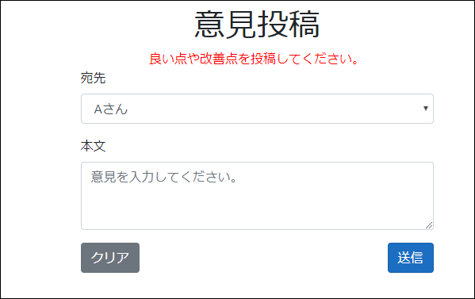
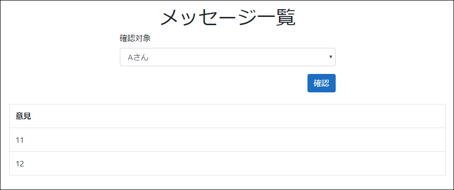
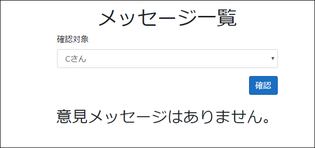

# 簡易意見箱
**匿名**で上司などに意見書を送信できる意見箱システムです。  
小規模な組織で使う目的で実装しています。

## 特徴
### 機能
* 投稿者用(匿名投稿者)
  * 意見メッセージ投稿機能

* 受信者用(意見書受信者:上司など)
  * 意見メッセージ一覧機能

### 注意事項
* テキストファイルで永続化(DB未使用)
* 意見メッセージ一覧用のログイン機能なし

## 開発環境
* Visual Studio 2019 Community
* .NET Core 3.1.100

## 実行環境
* .NET Core 3.1.100

## 実行方法
* Visual Studio(2019以上)を利用する場合  
   IkenBako.slnを開いて実行

* dotnetコマンドを利用する場合  
   ```sh
   #IkenBako/IkenBako.csprojを実行(ctrl+cで終了)
   dotnet run --project ./IkenBako/IkenBako.csproj

   # 例：ブラウザで http://localhost:5000 にアクセス
   #
   #出力例：
   # info: Microsoft.Hosting.Lifetime[0]
   #       Now listening on: http://localhost:5000
   #
   # ・・・(以下略)・・・

  ```

## Dockerでの実行
dockerがインストール済みであること  
また、下記のファイルを利用する
* docker/dockerfile
* docker/docker-compose.yml

### 手順
1. 本リポジトリをclone
2. ```cd docker```を実行
3. 初回のみビルドを実行  
   ```docker-compose build```
4. コンテナ起動（アプリケーションの実行）  
   ```docker-compose up -d```
5. コンテナ停止・削除（アプリケーションの終了）
   ```docker-compose down```

## Dockerコンテナ上での開発
Dockerコンテナ上で.NET Core開発環境を構築する  
dockerがインストール済みであること  
また、下記のファイルを利用する  
* docker_dev/dotnet_dockerfile  
  .NET Core用
* docker_dev/postgresql_dockerfile  
  PostgreSQL用
* docker_dev/docker-entrypoint-initdb.d/init.sh  
  PostgreSQL初回実行用SQL
* docker_div/docker-compose.yml

### 手順
1. 本リポジトリをclone
2. ```cd docker_div```を実行
3. 初回のみビルドを実行  
   ```docker-compose build```
4. コンテナ起動（アプリケーションの実行）  
   ```docker-compose up -d```
5. コンテナ停止・削除（アプリケーションの終了）
   ```docker-compose down```

※Visual Studio Codeの拡張機能「Docker for Visual Studio Code」の利用を推奨する

## 利用可能DB
下記DBの利用が可能。
* SQLite  
  ※サンプルとして「IkenBako/Resource/Test.db」をビルド時にコピーしている
* PostgreSQL
* SQLServer

### DB設定
「IkenBako/appsettings.json」または環境変数に記述する  
* appsettings.json  
  ```json
  "DB": {
    "ConnectionStrings": {
      "sqlite": "Resource/Test.db",
      "postgres": "Server=postgresql_server;Port=5432;User Id=test;Password=test;Database=testDB",
      "sqlserver": "Data Source=.\\SQLEXPRESS;Database=master;Integrated Security=True;"
    },
    "Target": "sqlite"
  }
  ```  
  * DB/ConnectionStrings  
    DBごとの接続文字列(SQLiteはファイルパス)
  * DB/Target  
    利用するDB(sqlite/postgres/sqlserver)  

* 環境変数  
  コロン(:)で区切る
  ```YAML
   "DB:ConnectionStrings:sqlite": "Resource/Test.db"
   "DB:ConnectionStrings:postgres": "Server=postgresql_server;Port=5432;User Id=test;Password=test;Database=testDB"
   "DB:Target": "sqlite"
  ```  

### アプリケーション設定
「IkenBako/appsettings.json」または環境変数に記述する  
* appsettings.json  
  ```json
  "Setting": {
    "AllLogin": "true"
  }
  ```  
  * Setting/AllLogin  
    すべてのユーザーはログイン必須(true/false)  
    省略時：false

* 環境変数  
  コロン(:)で区切る
  ```YAML
   "Setting:AllLogin": "true"
  ```  

### テーブルレイアウト  
現時点のテーブルレイアウトは下記の通り

**m_user**(ユーザーマスタ：ログイン用マスタ)
|カラム名|論理名|型|NOT NULL|備考|
|-------|-------|-----|:----:|-------|
|unique_name|ユニークな略称|varchar(255)|〇|主キー|
|password|暗号化したパスワード|varchar(255)|〇||
|salt|暗号化パラメータ|varchar(255)|〇||

**m_receiver**(上司マスタ)
|カラム名|論理名|型|NOT NULL|備考|
|-------|-------|-----|:----:|-------|
|unique_name|ユニークな略称|varchar(255)|〇|主キー|
|fullname|氏名|varchar(255)|〇||

**t_message**(メッセージテーブル)
|カラム名|論理名|型|NOT NULL|備考|
|-------|-------|-----|:----:|-------|
|id|連番|SERIAL|〇|主キー|
|send_to|送信対象の上司略称|varchar(255)|〇||
|detail|送信メッセージ|varchar(255)|〇||

## 画面イメージ
* ログイン画面  
    

* 意見投稿画面  
    

* 意見一覧：メッセージ受信者対象選択  
     

* 意見一覧：メッセージ一覧  
    

* 意見一覧：メッセージなし  
    

## ツール
* 暗号化済パスワード、ソルトの取得ツール：tools/createPassword  
  パスワードを入力するとソルト、暗号化済パスワードが表示される。  
  ※
  パスワード未入力の場合は処理を終了する。  
  ```sh
  cd tools/createPassword/createPassword
  
  dotnet run  
  ```  
  実行例)  
  ```sh
  > dotnet run
  Enter a password: test
  Salt: rQkt7trGTiXBpvC216gSOw==
  Encrypted Password: zBZQ8SZt420B4KoP/m/98g7qbESsYpLm7R8fxkFL6zE=

  Enter a password:
  ```  
  また、outputフォルダに「*パスワード*.txt」を作成し、暗号化済パスワードとソルトを書き込む  
  例)output/test.txt  
  ```
  > Encrypted Password:
  GO7PZAxjVWVYCeDcVdIkW5zVrUXL7lHOqWa+u6axcw8=
  > Salt:
  B1QhbD/UUcvt6+p68tWXTQ==
  ```

